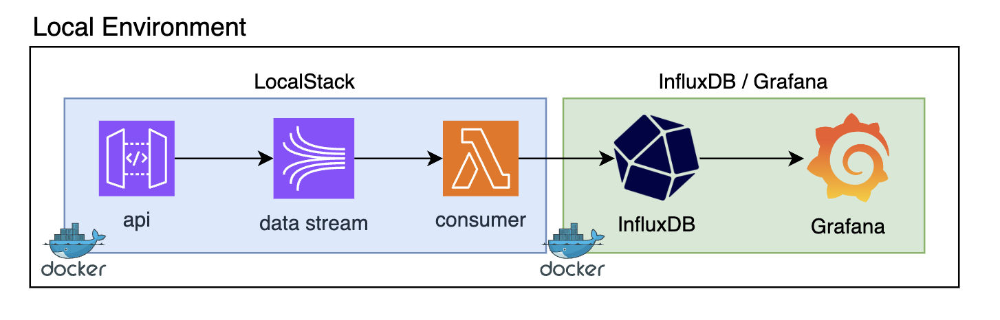
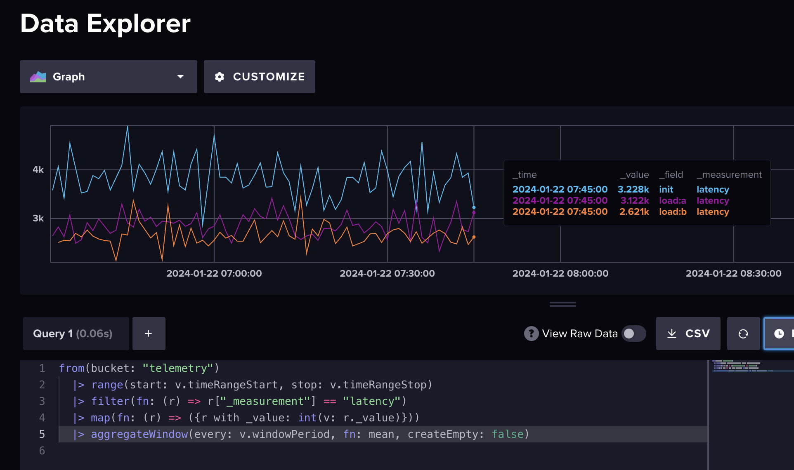

# AWS InfluxDB/Grafana Pipeline

This project contains scripts, code samples, and Terraform templates attempting to
provide an early-stage turnkey telemetry stack for large scale products. Telemetry
and data tracking is often an afterthought, and providing a way to track, query,
and visualize data stories from the beginning of a project is important.

## Software and Technologies

 * [Docker](https://www.docker.com)
 * AWS using [LocalStack](https://localstack.cloud)
   * API Gateway
   * Kinesis Data Stream
   * Event Bridge
   * Lambda (Kinesis Consumer)
   * CloudWatch
   * IAM
 * [InfluxDB OSS](https://docs.influxdata.com/influxdb/v2/) / [Grafana OSS](https://grafana.com/oss/)
 * [Terraform](https://www.terraform.io/)

## Architecture & Setup



When running locally, this image represents the infrastructure and data flow through
the system. After spinning up the infrastructure with Terraform, the output will
contain the URL of your local API Gateway.

Once you have cloned the repository, the following series of commands will help you
get up and running:

```sh
# start up localstack
$ ./scripts/localstack/dev start

# start up influxdb & grafana
$ ./scripts/grafana/dev start
```

You can build the zip artifact necessary for your lambda deployment by using the
following script:

```sh
$ ./scripts/lambda/dev build aws-kinesis-consumer
```

With the prerequisite docker images running locally, you can use Terraform to quickly
launch your stack:

```sh
# navigate to the project directory
$ cd projects/localstack

# initialize, plan, and apply your templates
$ terraform init
$ terraform plan
$ terraform apply
```

If you forget what the address is for your current API Gateway, you can always examine
the Terraform outputs again from this same directory:

```sh
$ cd projects/localstack
$ terraform output
```

Take note of the output, as you will need this API Gateway URL to send event payloads.

## Demo Data

In addition to setting up the infrastructure, there are some scripts provided to help
generate some sample timeseries data and hydrate the InfluxDB (via the API) in order
to test the full stack.

```sh
# generate a log file containing random data over the last three hours
$ ./scripts/grafana/dev generate-demo

# hydrate your generated log file into your InfluxDB
$ ./scripts/grafana/dev hydrate-demo <your-apigateway-url>
```

**NOTE:** Your data may continue to drain through the LocalStack ecosystem for several
minutes beyond the formal execution of this script.

Once this is complete, you can log into your local InfluxDB UI and query the data. This
image is an example Flux query showing demo data:

